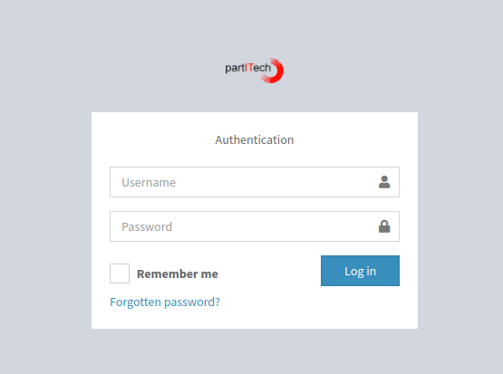
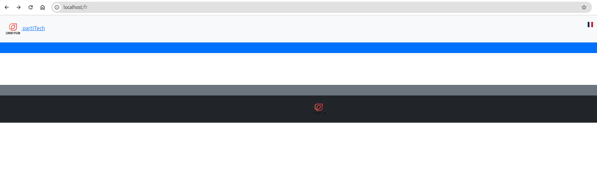
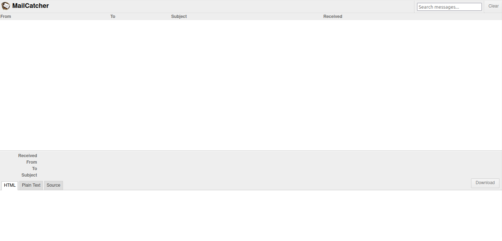

# Sonata Extra Demo Installation Guide

This guide will walk you through setting up and running the **Sonata Extra Demo** project locally.

## Prerequisites

Ensure your environment meets the following requirements:

- **Docker**: Docker and Docker Compose must be installed.
- **Git**: Required to clone the project repository.

## Installation Steps

### 1. Clone the Repository

Begin by cloning the repository from GitHub:

```bash
git clone https://github.com/partITech/sonata-extra-demo.git
cd sonata-extra-demo
```

### 2. Set Up Environment Variables

Copy the environment configuration file and ensure the necessary values are set:

```bash
cp env.dist .env
```

By default, the following credentials are used for the database:

```bash
SQL_ROOT_PASSWORD=toor
SQL_DATABASE=sonata-extra-demo
SQL_USER=root
SQL_PASSWORD=toor
SQL_PORT=3306
```

Ensure that your `.env` file contains the correct values or update them as necessary.

### 3. Start Docker and Build Containers

You can either use the pre-built Docker image or compile your own image using the provided Dockerfile. This Docker image is an "all-in-one" setup with everything required for the project. You can find the source Dockerfile at: [Dockerfile](https://raw.githubusercontent.com/partITech/docker-apache-php/refs/heads/main/Dockerfile).

To start and build the Docker containers, run:

```bash
docker-compose up --build
```

This will start all the necessary services:
- `www`: PHP application running Apache.
- `db`: MariaDB for database.
- `phpmyadmin`: PHPMyAdmin for database administration.
- `mailcatcher`: Captures outgoing emails.

The MySQL data is stored in `./config/docker/data-sql/`, and the database can be automatically initialized by placing the SQL creation file in `./config/docker/init-sql/`. You can modify or comment out the following lines in the Docker configuration file to change this behavior:

```yaml
db:
  hostname: sonata_extra_demo_db
  image: mariadb
  ports:
    - 3306:3306
  command: --default-authentication-plugin=mysql_native_password
  environment:
    MYSQL_ROOT_PASSWORD: 'toor'
    MYSQL_DATABASE: 'sonata-extra-demo'
    MYSQL_USER: 'sonata'
    MYSQL_PASSWORD: 'toor'
  volumes:
    - ./config/docker/data-sql/:/var/lib/mysql # MySQL data storage
    - ./config/docker/init-sql/:/docker-entrypoint-initdb.d # Automatic database initialization
```

### 4. Load the default db

You don't need to do this if you moved the demo sql file in `/config/docker/init-sql/`.
```bash
docker compose exec -T www mysql -h db -u root -ptoor sonata-extra-demo < sonata-extra-demo.sql

```


### 5. Install PHP Dependencies

Once the containers are running, install the PHP dependencies:

```bash
docker compose exec -T www composer install
```


### 6. Install Frontend Assets

This step should be handled  by composer install. Alternatively, you can execute these steps one by one.
This step installs the Gutenberg editor and the latest free version of CKEditor. If you have a valid licence for CKEditor, it is recommended to remove the `--tag=4.19.0` option to install the latest licensed version.


```bash
docker compose exec -T www symfony console sonata:extra:install-gutenberg
docker compose exec -T www symfony console ckeditor:install --tag=4.19.0
docker compose exec -T www symfony console asset:install
```

### 7. Set Up Sonata and Fix Routes

Run the following commands to set up multilingual support for the demo and ensure correct routing:

```bash
docker compose exec -T www symfony console sonata:page:create-site --enabled --name France --relativePath /fr --host localhost --enabledFrom now --enabledTo 2030-10-18 --locale fr --default --no-confirmation
docker compose exec -T www symfony console sonata:page:create-site --enabled --name English --relativePath /en --host localhost --enabledFrom now --enabledTo 2030-10-18 --locale en --no-confirmation
docker compose exec -T www symfony console sonata:page:update-core-routes
docker compose exec -T www symfony console sonata:extra:page-fix-route
docker compose exec -T www symfony console sonata:page:create-snapshots
```

### 8. Admin Access and Creating/Changing the Admin Password

Create the Super Admin user. You can adjust the credentials as needed:

```bash
docker-compose exec www symfony console sonata:user:create --super-admin admin your@email.com demo
```

To access the admin panel, use the following credentials:

- **URL:** `http://localhost/fr/admin/login`
- **Login:** `admin`
- **Password:** `demo`



To change the password of any user, use the following command:

```bash
docker-compose exec www php bin/console sonata:user:change-password admin new_password
```

### 9. Accessing the Application

Once the setup is complete, the demo application is accessible at:

```
http://localhost
```

You should be able to see the homepage and switch between French and English using the language selector.




### 10. Accessing PHPMyAdmin

Manage the database using PHPMyAdmin at:

```
http://localhost:8081
```


Login credentials:

- **Server:** `db`
- **Username:** `root`
- **Password:** `toor`
- **Port:** `3306`

These credentials are from your `.env` file.
The server adress and port is the name of the db container from your docker configuration.

### 11. Using Mailcatcher

To view captured outgoing emails, access Mailcatcher at:


```
http://localhost:1080
```


The configuration in the `.env` file is:
```
MAILER_DSN=smtp://localhost:1025
```


## Troubleshooting

If you encounter any issues:

- Ensure Docker and Docker Compose are properly running.
- Verify that the `.env` file is configured correctly.
- Check for container errors using `docker-compose logs`.
- Always remember to run `sonata:extra:page-fix-route` after creating a new site or a new route to ensure the relations between routes and languages are correctly established.


## Contributing

We welcome contributions! Submit your Pull Requests for improvements, bug fixes, unit tests, and new features. Contributions to the documentation are also appreciated.

---

Enjoy using **Sonata Extra Demo**!
